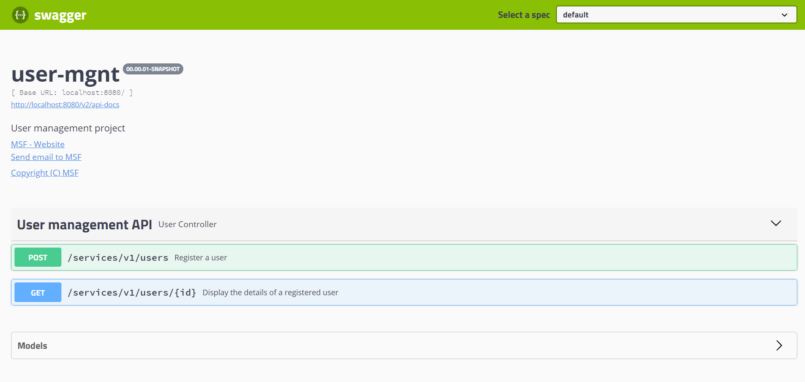

# user-mgnt

## Requirements

For building and running the application you need:

- [JDK 11](https://www.oracle.com/in/java/technologies/javase/jdk11-archive-downloads.html)
- [Maven 3](https://maven.apache.org)

## Running the application locally

There are several ways to run a Spring Boot application on your local machine. One way is to execute the `main` method in the `fr.af.test.offer.usr.UserMgntApplication` class from your IDE.

Alternatively you can use the [Spring Boot Maven plugin](https://docs.spring.io/spring-boot/docs/current/reference/html/build-tool-plugins-maven-plugin.html) like so:

```shell
mvn spring-boot:run
```

## Deploying the application to OpenShift

The easiest way to deploy the sample application to OpenShift is to use the [OpenShift CLI](https://docs.openshift.org/latest/cli_reference/index.html):

```shell
oc new-app fayems/user-mgnt-maven3-centos~https://github.com/fayems/user-mgnt
```

This will create:

* An ImageStream called "user-mgnt-maven3-centos"
* An ImageStream called "user-mgnt"
* A BuildConfig called "user-mgnt"
* DeploymentConfig called "user-mgnt"
* Service called "user-mgnt"

If you want to access the app from outside your OpenShift installation, you have to expose the user-mgnt service:

```shell
oc expose user-mgnt --hostname=www.example.com
```

# Check Out the Swagger UI

Open a browser and key in URL:

```
$ open http://localhost:8080/swagger-ui.html
```
Authenticate with admin/secret



> Note:
> - All the APIs can be playing through the UI

## Copyright

Released under the Apache License 2.0. See the [LICENSE](https://github.com/codecentric/springboot-sample-app/blob/master/LICENSE) file.
